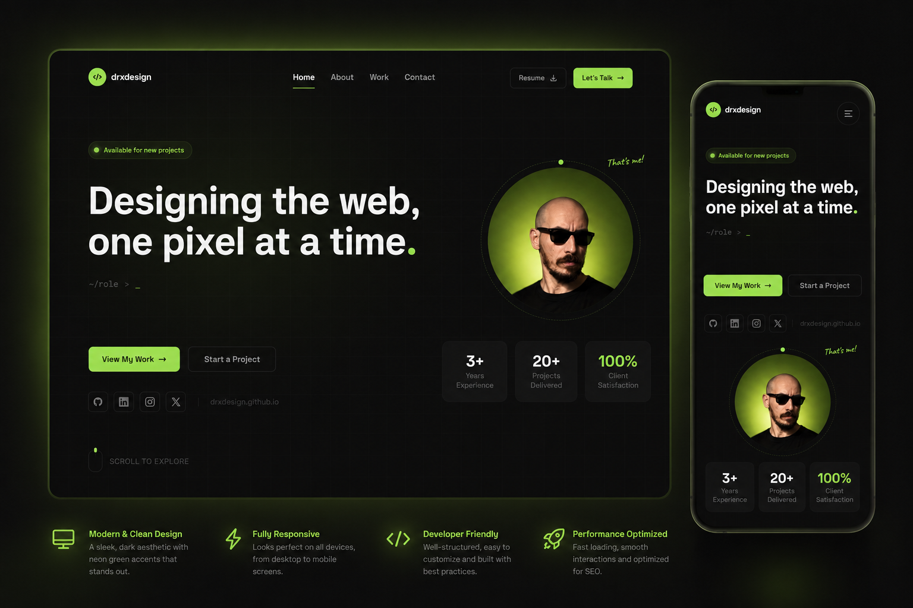

<div align="center">

<br/>

```
 ██████╗ ██████╗ ██╗  ██╗██████╗ ███████╗███████╗██╗ ██████╗ ███╗   ██╗
 ██╔══██╗██╔══██╗╚██╗██╔╝██╔══██╗██╔════╝██╔════╝██║██╔════╝ ████╗  ██║
 ██║  ██║██████╔╝ ╚███╔╝ ██║  ██║█████╗  ███████╗██║██║  ███╗██╔██╗ ██║
 ██║  ██║██╔══██╗ ██╔██╗ ██║  ██║██╔══╝  ╚════██║██║██║   ██║██║╚██╗██║
 ██████╔╝██║  ██║██╔╝ ██╗██████╔╝███████╗███████║██║╚██████╔╝██║ ╚████║
 ╚═════╝ ╚═╝  ╚═╝╚═╝  ╚═╝╚═════╝ ╚══════╝╚══════╝╚═╝ ╚═════╝ ╚═╝  ╚═══╝
```

### `< Personal Portfolio />`

*Crafted with precision · Animated with intent · Built to impress*

<br/>

[](https://astro.build)
[](https://tailwindcss.com)
[](LICENSE)
[](https://drxdesign.github.io)

<br/>

<!-- Replace the src below with your actual preview image -->


<br/><br/>

</div>

---

## ✦ Built With

<div align="center">

| | Technology | Version | Role |
|---|---|---|---|
|  | [**Astro.js**](https://astro.build) | `6.x` | Static site framework |
|  | [**Tailwind CSS**](https://tailwindcss.com) | `4.x` | Utility-first styling |
|  | **GSAP** | `3.x` | Scroll & motion |
|  | **GitHub Pages** | — | Hosting & deployment |

</div>

---

## ✨ Features

```
  ◆  Typing animation              — Hero headline cycles through roles
  ◆  Scroll-reveal animations      — Sections fade in on scroll
  ◆  Animated skill bars           — Progress fills on intersection
  ◆  Floating particles            — Ambient hero atmosphere
  ◆  Sticky navbar                 — Highlights active section
  ◆  Mobile slide-in menu          — Smooth full-screen overlay
  ◆  Working contact form          — Sends directly to email via Formspree
  ◆  Fully responsive              — Pixel-perfect on all screen sizes
  ◆  Static output                 — Zero JS runtime, blazing fast
```

---

## 🚀 Getting Started

### Prerequisites

- **Node.js** `v18+`
- **npm** or **pnpm**

### Install & Run

```bash
# 1 — Clone the repository
git clone https://github.com/drxdesign/drxdesign.github.io.git
cd drxdesign.github.io

# 2 — Install dependencies
npm install

# 3 — Start the dev server
npm run dev
# ┌─────────────────────────────────────────┐
# │  🚀  http://localhost:4321              │
# └─────────────────────────────────────────┘

# 4 — Build for production
npm run build

# 5 — Preview the production build
npm run preview
```

---

## 📁 Project Structure

```
drxdesign.github.io/
│
├── 📂 public/
│   ├── favicon.svg           — Site icon
│   ├── cv.pdf                ← Add your CV here
│   ├── profile.jpg           ← Add your photo here
│   └── preview.png           ← Add your preview image here
│
├── 📂 src/
│   ├── 📂 components/
│   │   ├── Navbar.astro      — Sticky nav + mobile menu
│   │   ├── Hero.astro        — Typing animation + particles
│   │   ├── About.astro       — Skills bars (scroll-animated)
│   │   ├── Work.astro        — Project cards with mockups
│   │   ├── Contact.astro     — Form wired to Formspree
│   │   ├── Footer.astro      — Footer with social links
│   │   └── SocialLinks.astro — Reusable icon row
│   │
│   ├── 📂 layouts/
│   │   └── Layout.astro      — Base HTML shell
│   │
│   ├── 📂 pages/
│   │   └── index.astro       — Main page entry point
│   │
│   ├── 📂 scripts/
│   │   └── scrollReveal.ts   — IntersectionObserver reveal
│   │
│   └── 📂 styles/
│       └── global.css        — Global styles + Tailwind theme
│
├── astro.config.mjs           — Astro configuration
├── postcss.config.mjs         — PostCSS + Tailwind 4 setup
└── package.json
```

---

## 🎨 Customisation

| What | Where | How |
|---|---|---|
| Name & tagline | `src/components/Hero.astro` | Edit the `<h1>` and subtitle text |
| Profile photo | `public/profile.jpg` | Replace the file, keep the same name |
| Typing words | `src/components/Hero.astro` | Edit the `words` array in the `<script>` |
| Skills & levels | `src/components/About.astro` | Edit the `skills` array |
| Projects | `src/components/Work.astro` | Edit the `projects` array |
| Social links | `src/components/SocialLinks.astro` | Edit the `links` array |
| Contact info | `src/components/Contact.astro` | Edit the `contactInfo` array |
| Brand colour | `src/styles/global.css` | Change `--color-accent: #9FE45A` in `@theme` |

---

## 📬 Contact Form

The form sends directly to email using **Formspree**.

To connect your own email:

1. Create a free account at [formspree.io](https://formspree.io)
2. Create a new form and copy your endpoint URL
3. Open `src/components/Contact.astro` and replace:

```js
// Find this line and swap in your own endpoint
const response = await fetch('https://formspree.io/f/YOUR_FORM_ID', {
```

> On first submission, Formspree will send a confirmation email — click it to activate delivery.

**Alternatives:**
- [EmailJS](https://emailjs.com) — client-side email, no backend needed
- Custom API route at `src/pages/api/contact.ts`

---

## 🚢 Deployment

This site auto-deploys to **GitHub Pages** on every push to `main`.

```bash
git add .
git commit -m "update portfolio"
git push
# ✓ GitHub Actions builds and deploys automatically
```

Live at → **[drxdesign.github.io](https://drxdesign.github.io)**

---

## 📄 License

```
MIT License — use it however you like.
```

---

<div align="center">

<br/>

*Designed & built by* **DRX Design**

[](https://drxdesign.github.io)

<br/>

</div>
